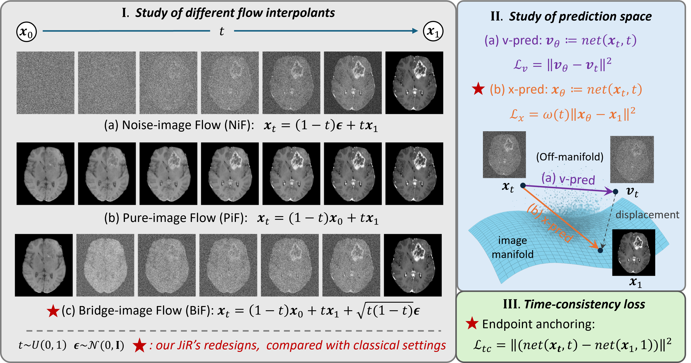

# JiR

**Time Matters: Rethinking Diffusion and Flow Models in One-Step Medical Image Translation**

JiR distills the time-conditioned part of diffusion/flow training into a one-step, deterministic medical image translation framework. The implementation follows the paper's task-driven design:

- a configurable continuous-time interpolant;
- direct prediction in the target image space;
- optional time-consistency regularization that anchors predictions along the trajectory.

The public recipes cover cross-modality MR-to-PET translation and multi-contrast MR translation on paired 3D volumes. The teaser above is the paper's main overview figure.

## Repository layout

~~~text
JiR/
├── assets/                 # paper overview figure
├── configs/                # JiR and direct-regression recipes
├── data/                   # paired-volume datasets and transforms
├── evaluation/             # image metrics
├── models/                 # time-conditioned model and networks
├── docs/                   # data/configuration/workflow notes
├── main.py
└── requirements.txt
~~~

## Installation

~~~bash
python -m venv .venv
source .venv/bin/activate       # Windows: .venv\Scripts\activate
python -m pip install --upgrade pip
python -m pip install torch torchvision torchaudio
python -m pip install -r requirements.txt
~~~

## Data

Set DATA_ROOT to a local copy of a paired dataset. The two bundled loaders expect the following neutral layouts:

~~~text
DATA_ROOT/
├── train/
│   ├── <class-or-case>/<case-id>/*.nii.gz   # MR-to-PET
│   └── <case-id>/*.nii.gz                    # multi-contrast MR
└── test/
~~~

The exact filenames are documented in docs/DATA.md. No local paths or subject identifiers are committed.

## Training

MR-to-PET:

~~~bash
export DATA_ROOT=/absolute/path/to/mri2pet
python main.py --config_path mri2pet/diffusion --run_name jir_mri2pet
~~~

Multi-contrast MR:

~~~bash
export DATA_ROOT=/absolute/path/to/brats
python main.py --config_path brats/diffusion --run_name jir_multicontrast
~~~

For a direct-regression reference, replace diffusion with baseline_resunet (or baseline-resunet for the BraTS recipe). Validation metrics and generated volumes are written below the run directory; use OUTPUT_ROOT to place them elsewhere.

## Citation

~~~bibtex
@inproceedings{mei2026jir,
  title     = {Time Matters: Rethinking Diffusion and Flow Models in One-Step Medical Image Translation},
  author    = {Mei, Siyuan},
  booktitle = {MICCAI 2026},
  year      = {2026},
  note      = {Accepted for oral presentation}
}
~~~

See CITATION.cff for citation-manager metadata.

## License

This project is released under the MIT License. See LICENSE.
